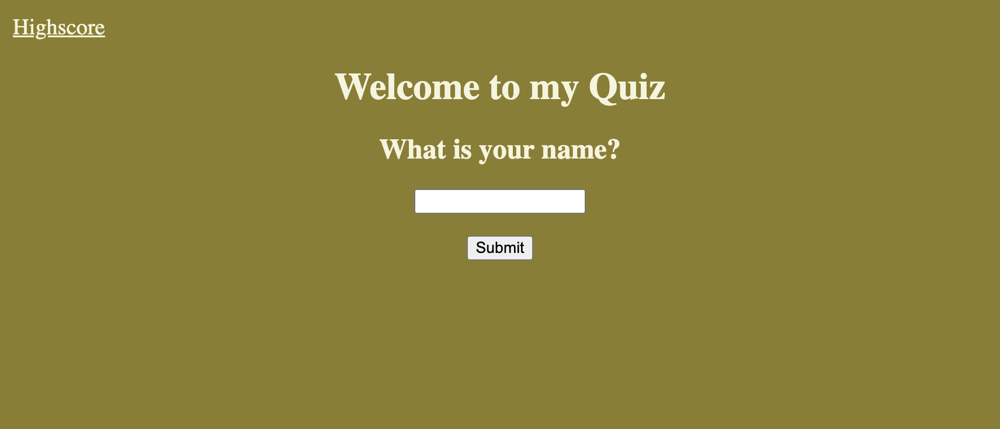
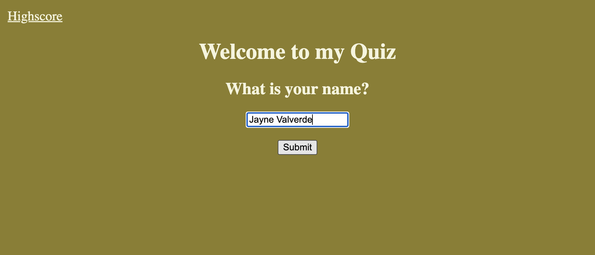
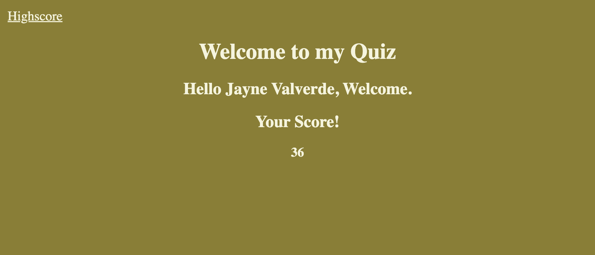

# Timed JavaScript-Quiz
## Jayné M. Valverde
[Jayne's Timed JavaScript Quiz](https://jaynevalverde.github.io/JavaScript-Quiz/)

## Timed Quiz 
* You are first promoped to enter your name and click submit.
* The welcome screen displays your name and a greeting.
* When the submit button is clicked, the timer starts. 
* When the clock starts running, the quiz starts. 
* If you get an answer wrong, the time decreased by 10 seconds and the page switches to the next question. If you get the answer right, the timer does not decrease and the next set of questions and answers are displayed.
* When the quiz ends, the timer stops and you score is displayed on the screen. 
* You can then check you highscores by clicking 'Highscores' on the top left hand side of the screen. 

I was able to get the questions/answers to display and change as the questions were being answered. 

## Highscore storage
* HIGH SCORE STORAGE/ LOCAL STORAGE NEEDS TO BE EXECTUTED !

## JavaScript Quiz screenshot

Start Screen  

User enters their name before clicking submit and starting the quiz  

User is presented a question and some answers to chose from. 
Timer is shown below and counts down from 60 seconds.  

Once user as finsihed answering all the quesitons, the timer stops and displays their score. 

## Resources 
* RESOURCES NEED TO BE CITED!