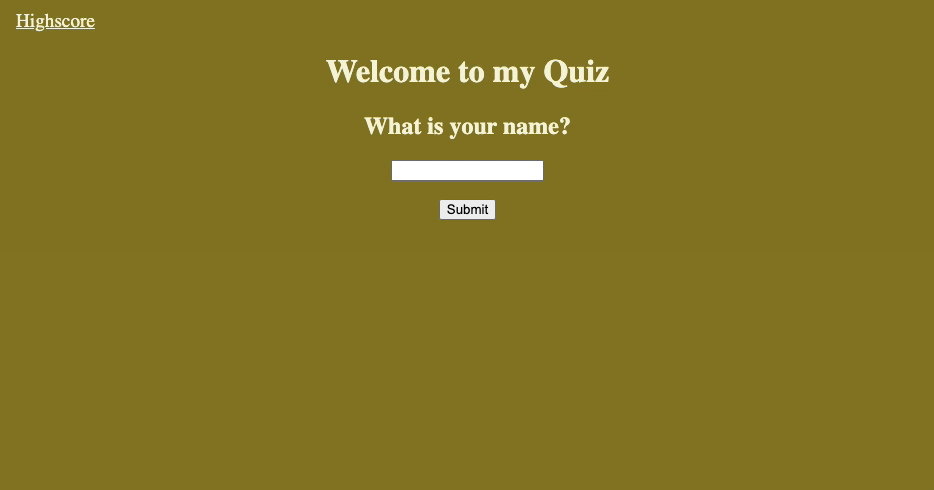

# Timed JavaScript-Quiz
## Jayné M. Valverde
[Jayne's Timed JavaScript Quiz](https://jaynevalverde.github.io/JavaScript-Quiz/)

## Timed Quiz 
* You are first promoped to enter your name and click submit.
* The welcome screen displays your name and a greeting.
* When the submit button is clicked, the timer starts. 
* When the clock starts running, the quiz has begun. 
* If you get an answer wrong, the time decreased by 10 seconds and the page switches to the next question. If you get the answer right, the timer does not decrease and the next set of questions and answers are displayed.
* When the quiz ends, the timer stops and your score is displayed on the screen. 
* You can then check you highscores by clicking 'Highscores' on the top left hand side of the screen. 
* There you will see the user names that were inputed, along with the scores they recived after taking the quiz. 

## JavaScript Quiz Preview

## Resources 

**Faran Navazi**:  
This tutor was suggested to me by a classmate, Sarah Squyres, and he is a big reason why my code is as organized as it is now. A few days before meeting with him I had an app that was just barely working, but had a lot of bug; Unnecessary syntax, old code that was tried out and not properly deleted. Lots of clutter. He helped me organize my thoughts and figure out a way to take things step by step.  
Specifically with the arrays checking action function. 

**AskBCS**:   
I really utilized the heck out of them this week. I would ask for one small portion of help and they walked me through it. They gave me suggestions on what to look up, what to study on more and what mistakes I was making along the way. I would not have been able to fully make the **local storage** functions work the way they do without them.

**Youtube**: 
[**Making a simple quiz webpage using HTML and JS**: Keith Paterson](https://youtu.be/79WRPIknVHs)  

* I used used this for some elements and then realized a lot of this code did not apply to what we needed for the assignment. Lots of lessons learned from this approach.  

**Medium**: 
[**Michael Karen**: How to save high scores in local storage ](https://michael-karen.medium.com/how-to-save-high-scores-in-local-storage-7860baca9d68)  

**W3Schools**  
* [Setting intervals](https://www.w3schools.com/jsref/met_win_setinterval.asp)  
* [General resource for other information](https://www.w3schools.com/)